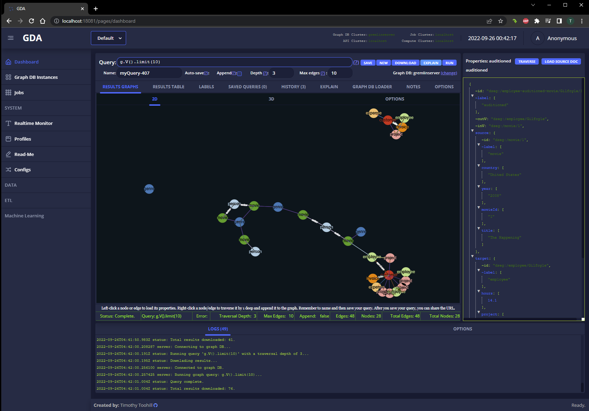
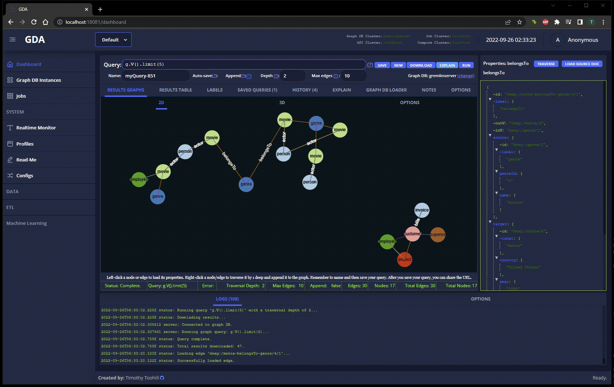
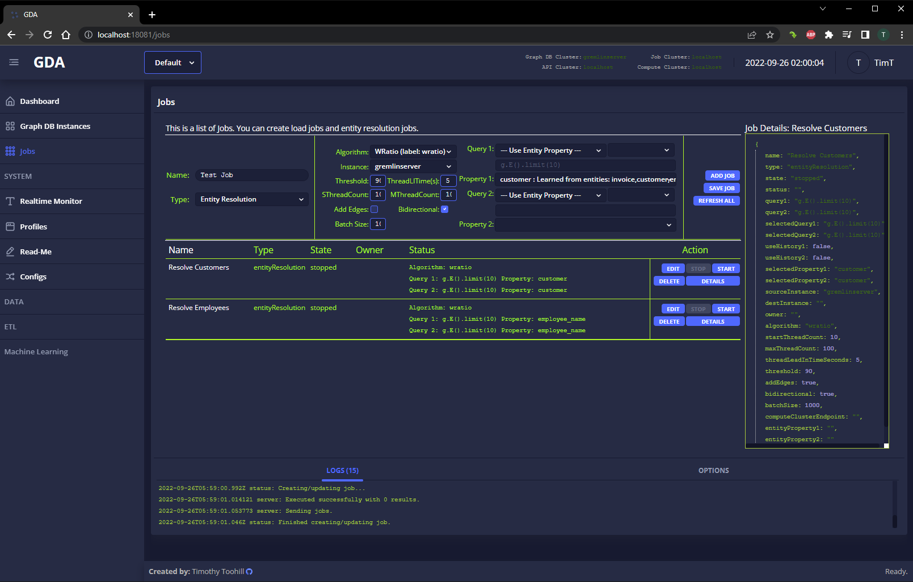
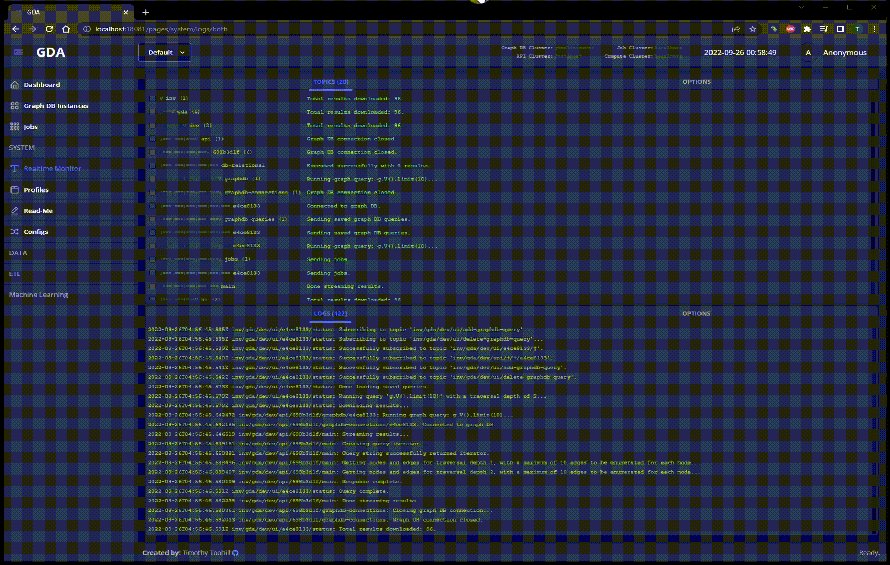
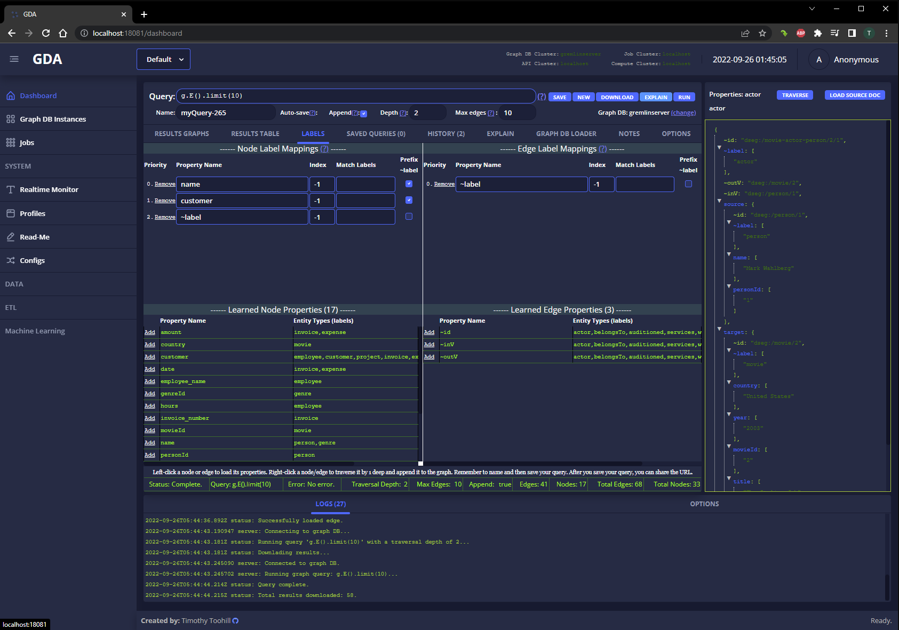

# GDA
Graph Data Analytics (GDA) is a scalable, microservice-based, experimental platform prototype for querying, visualizing, and analyzing property graph data. GDA was initially developed for AWS Neptune, but Neptune could not handle large scales of data. Currently, only Gremlin queries are supported by GDA, but I have plans for a custom graph query language.



# Running GDA
## Docker Compose
GDA can be run using `docker compose`:
1. Clone the repo and change to its directory:
```shell
git clone https://github.com/timothytoohill/gda.git
cd gda
```
2. Run docker compose:
```shell
docker compose up
```
Alternatively, you can start GDA in the background using:
```shell
docker compose create --no-recreate
docker compose start
```
To stop the GDA containers:
```shell
docker compose stop
```
To remove the GDA containers:
```shell
docker compose down
```
3. The GDA UI defaults to using HTTP port 18081. For example, if you ran GDA on your local workstation, you can browse to: `http://localhost:18081/`
### Windows
GDA can be run with Docker on Windows if Docker is installed. Similar to the commands for Linux, you can run `docker compose` from within the cloned repo directory. 
However, I found that the Windows shell did not process the `${PWD}` variable in the docker-compose.yml file, so instead, I used the Git Bash shell for Windows to start GDA using `docker compose`.
To load the sample data, you will need to have Python 3.10 installed.
## Running manually
The GDA backend uses Python 3.10 for the microservices. To manually run the services, first get familiar with the code, and then start them manually:
1. The API server can be started with the `api/server.py file`.
2. The UI can be started with NPM or the `ui/uiserver.py` file can be used.
3. The relational DB, MQ, and graph DB services can be installed manually or the docker containers can be used.
# Loading sample data
With GDA running, you can load sample data using the sample Python scripts in the `util/loader` directory:
```
cd util/loader
python3 loadsample01.py
python3 loadsample02.py
```
# Graph Queries
Currently, GDA only support Gremlin queries. Here are some example queries that can be run after the sample data has been loaded:
```shell
g.V().limit(10)
g.E().hasLabel('belongsTo')
g.V().has('genre', 'name', 'Drama').in_('belongsTo')
```
## Automatic Traversal For Exploration
One of the goals for GDA is to enable graph exploration. GDA can automatically traverse graph query results so that the user can see the context of entities and relationships. 

# Configuration
The configuration files for GDA are located in `libraries/configs`. 
## Docker Compose
If you are using `docker compose` to run GDA, the `libraries/configs/base.json` file is mounted to the relevant containers. If you modify `libraries/configs/base.json`, it will be used by GDA when you restart the containers. The application's title, footer, etc, can be changed in the configuration file.

# Features and Goals
## Scalability
GDA supports large-scale graph analytics, machine learning, and ETL pipelines. Currently, the backend graph database uses Janus Graph, Cassandra, and Solr, which makes GDA scalable to support very large datasets.
## Machine Learning and AI
Graph data strctures, when modelled propery, can be very useful for performing analytics across disparate data sources. 
## Entity resolution
GDA performs rudimentary entity resolution, and I intend to extend this capability while I evolve the platform. Entity resolution is accomplished via 'jobs' that can be created, started, and left running. Graph queries are used to supply the job with the entities to be resolved, and edges can be automatically created if the algorithm identifies a match.

GDA jobs can be run currently. The backend microservices can be run inside of scalable container clusters to handle increasing scales of data.

## Hierarchical, real-time logging and instrumentation
Most large-scale analytic platforms that use multiple sources of data have to evolve constantly. Engineers have to add new transforms to a pipeline, troubleshoot problems, or add support for a new data source. These platforms also often need to support automation using machine learning and AI. As a result, it is common for the platform to be developed while it is being used. 

Engineers rely on logs for troubleshooting. When identifying the source of a problem, I found that I would need to actively monitor logs in real time. Logging ecosystems, such as Elastic Beats, are great for searching historical logs, but their eventual consistency makes them less than ideal for real time troubleshooting. For GDA, I wanted to experiment with a global, hierarchical logging system that supports subscriptions to any part of the logging hierarchy for real-time observation. I also wanted to be able to use this logging system during development so that the logging output of the different microservices could be seen together in one output. Because GDA is a scalable prototype, I wanted to use a lightweight protocol that could be supported by cloud native services. I decided to use MQTT and the mosquitto pub/sub message broker, with the expectation of switching to something more robust like RabbitMQ or even Kafka/Pulsar. 



Additionally, I developed Python and TypeScript client libraries to implement simple, lightweight logging functions that could be easily used throughout the code base. These logging functions can output to the console (stdout), a local file, and send the log data to the MQTT broker to distributed to any subscriber, such as a UI or a logging database, such as Elasticsearch.  

While it needs many improvements, I found that the effect is what I expected. I was able to test and troubleshoot more effectively, and I was able to see how the platform was being used.

I added a dashboard to the GDA UI that lets the user view any part of the logging hierarchy while it streams from the MQTT message broker. Any part of the hierarchy tree can be collapsed so that only a sub set is shown and streammed from the message broker.

## Learned schema
Some graph databases do not provide a way to enumerate (or describe) the graph schema. This is because of the way they store graph data. As a result, the only way to discover the available entity and edge types, and their respective properties, is to 'learn' them from queries.

GDA learns schema from graph query results and stores the schema for future reference, such as for entity resolution. 


# To Do
There is a lot I would do to improve GDA. It is still in a prototype stage, so it's not yet ready for a production environment. 
1. Rewrite the backed to use a more performant runtime, such as Rust, Go, or even NodeJS would be better. The Python runtime is not ideal for performance.
2. Begin working on the ETL pipelining capabiities.